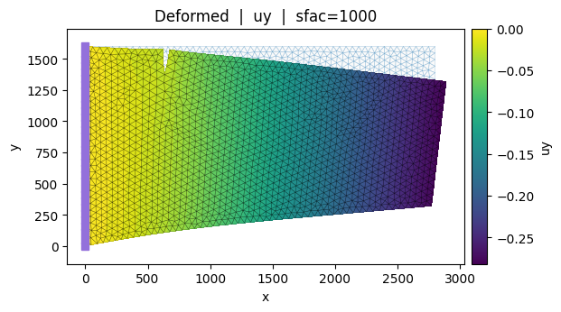
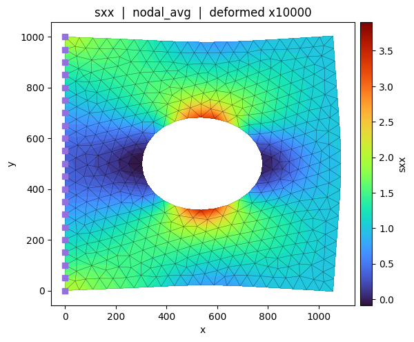
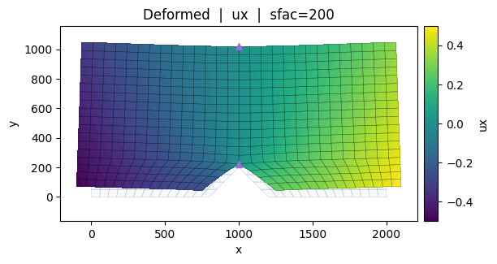
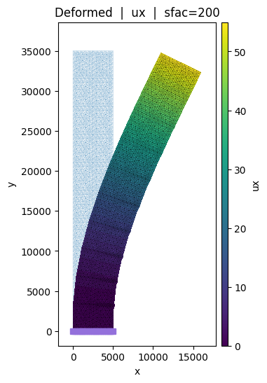
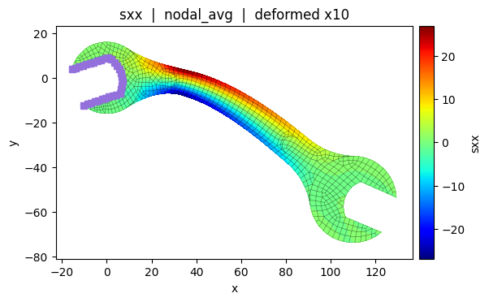
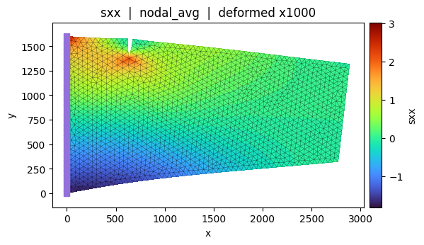
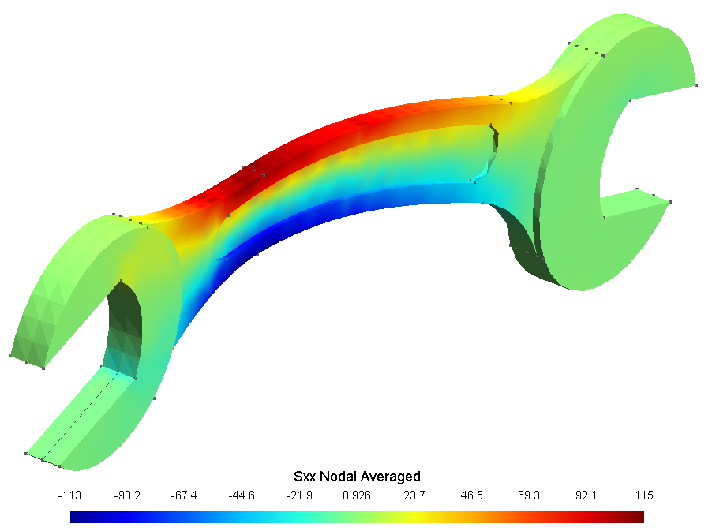
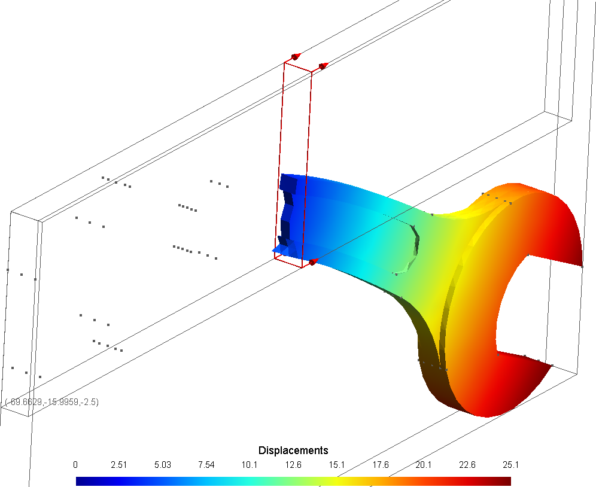

# FEM – Finite Element Analysis

A Python library for structural analysis using the Finite Element Method, developed for educational and research purposes in civil and structural engineering.

> Based on the FEM course by Prof. José Abell — Universidad de los Andes.
---

## Features

- Modular element library covering 1D, 2D, and membrane elements.
- Implements the following element types:
  - **Truss2D** – 2-node axial element (2 DOF/node)
  - **Frame2D** – 2-node Euler-Bernoulli beam-column (3 DOF/node)
  - **CST** – Constant Strain Triangle (3 nodes · 6 DOF)
  - **LST** – Linear Strain Triangle (6 nodes · 12 DOF)
  - **Quad4** – Bilinear Quadrilateral (4 nodes · 8 DOF)
  - **Quad9** – Biquadratic Lagrangian Quadrilateral (9 nodes · 18 DOF)
- Full isoparametric formulation with Gauss-Legendre numerical integration.
- Direct Stiffness Method (DSM) assembly pipeline.
- gmsh-based mesh generation and node/element import.
- Interactive Jupyter widgets for visualization of shape functions, Jacobian fields, B-matrix, and stiffness integrand components.
- Rigid body mode verification for membrane elements.

---

## Requirements

- Python 3.8 or higher
- Python libraries:
  - `numpy`
  - `scipy`
  - `sympy`
  - `matplotlib`
  - `gmsh`
  - `ipywidgets`
  - `jupyter`

---

## Installation

Clone the repository and install dependencies:

```bash
git clone https://github.com/ppalacios92/FEM.git
cd FEM
pip install -e .
```

---

## Repository Structure

```bash
FEM/
├── src/
│   └── fem/
│       ├── core/             # Node, Material, parameters
│       ├── elements/         # CST, LST, Quad4, Quad9, Truss2D, Frame2D
│       ├── sections/         # Membrane section
│       └── utils/            # functions, gmshtools, visualization, units
├── examples_1D/              # Frame2D / Truss2D — direct assembly, no gmsh
├── examples_2D/              # Membrane FEM — gmsh + own solver + matplotlib/gmsh plots
├── examples_3D/              # 3D solid — gmsh + OpenSees + gmsh visualization
├── docs/
│   └── images/               # Reference plots and visualization outputs
└── README.md
```

---

## Import Modules

```python
from fem import (
    Node, Material, Membrane,
    CST, LST, Truss2D, Frame2D, Quad4, Quad9,
    GMSHtools, build_elements,
    add_element_data_view, add_node_data_view, compute_nodal_average,
    plot_mesh, plot_loads_2d, plot_deformed, plot_field_2d, plot_gmsh_mesh,
    mm, cm, m, N, kN, tf, MPa, GPa, kg, g,
    globalParameters,
)
```

---

## Plotting

The library includes a built-in plotting module (`fem.utils.plotting`) for visualizing FEM results directly in Jupyter or any matplotlib environment. All functions follow a consistent interface and support exporting to file.

| Function | Description |
|---|---|
| `plot_mesh` | Mesh geometry with node/element labels and support symbols |
| `plot_loads_2d` | Normalized load arrows over mesh background |
| `plot_deformed` | Deformed shape colored by displacement component (`ux`, `uy`, `umag`) |
| `plot_field_2d` | Stress or strain field with smooth contour surface (`sxx`, `syy`, `vmis`, ...) |

All plot functions accept `show_element_edges`, `show_node_points`, `show_supports`, `figsize`, `ax`, and `save` for full control over the output.

---

## gmsh Integration

`GMSHtools` reads a `.msh` file generated by gmsh and instantiates a structured mesh object — nodes, elements, and physical groups are immediately accessible as attributes:

```python
mesh = GMSHtools('mesh.msh')
```

### Accessing mesh data

```python
mesh.nodes                           # {tag: (x, y, z)}  — all nodes in the mesh
mesh.elements                        # {phys_id: {gmsh_type, connectivity, ...}}
mesh.physical_groups                 # accessible by integer ID or name string
```

Physical groups can be queried by **ID** or by **name**, both return the same object:

```python
group = mesh.physical_groups[201]         # by physical group ID
group = mesh.physical_groups['Head_5mm']  # by name as defined in gmsh
```

Each `PhysicalGroup` exposes:

| Attribute | Type | Description |
|---|---|---|
| `.id` | `int` | Gmsh physical group ID |
| `.name` | `str` | Name as defined in gmsh |
| `.dim` | `int` | Dimension (0=point, 1=line, 2=surface) |
| `.nodes` | `dict` | `{tag: (x, y, z)}` — nodes belonging to this group |
| `.elements` | `dict` | Raw element data (connectivity, gmsh_type, etc.) |

```python
mesh.physical_groups[201].nodes      # {tag: (x,y,z)} of nodes in that group
mesh.physical_groups[201].elements   # raw element data for that group
mesh.physical_groups[201].dim        # 1 or 2
```

This object connects directly to the FEM assembly pipeline (`plan`, `build_elements`, `build_load_vector`) and to **OpenSeesPy** — nodes, boundary conditions, and elements can be built by iterating over the mesh object without any intermediate conversion.

---

## Workflows

### 1D — Frame / Truss
Direct assembly without gmsh. Nodes and elements defined manually, assembled with `matrix_replace`.

```python
globalParameters['nDoF'] = 3
globalParameters['nDIM'] = 2

n0 = Node(0, [0, 0],  restrain=['r', 'r', 'r'])
n1 = Node(1, [5, 0],  restrain=['f', 'f', 'f'], nodal_load=[0, -20, 0])
n2 = Node(2, [10, 0], restrain=['r', 'f', 'r'])

steel = Material(name='Steel', E=29000, nu=0.3, rho=0)
e0 = Frame2D(n0, n1, material=steel, A=3, I=400)
e1 = Frame2D(n1, n2, material=steel, A=3, I=400)
```

### 2D — Membrane (own solver)
Uses gmsh for mesh generation and the built-in FEM solver.

```python
globalParameters['nDoF'] = 2
globalParameters['nDIM'] = 2

mesh = GMSHtools(output_file)
mesh.apply_boundary_conditions(restrain_dictionary, load_dictionary, section_dictionary)

elements = build_elements(
    mesh=mesh, node_map=mesh.node_map,
    section_dictionary=section_dictionary,
    element_class_map={3: CST, 4: Quad4, 6: LST, 9: Quad9},
    load_dictionary=load_dictionary,
    type='planeStress', sampling_points=3,
)

# Consistent force vector
F_load = np.zeros(mesh.system_nDof)
for node in mesh.node_map.values():
    F_load[node.idx] += node.nodalLoad
for elem in elements:
    F_load[elem.idx] += elem.F_fe_global
```

### 3D — Solid (OpenSees solver)
Uses gmsh for mesh generation, OpenSees for analysis, and gmsh for visualization.

```python
globalParameters['nDoF'] = 3
globalParameters['nDIM'] = 3

mesh = GMSHtools(output_file)
F_nodal = mesh.build_load_vector(load_dictionary)  # {tag: [fx, fy, fz]}

# → send nodes, BCs, elements and loads to OpenSees
# → extract results and visualize in gmsh via add_node_data_view / add_element_data_view
```

---

## Basic Usage

```python
import numpy as np
from fem import Material, Membrane, Quad4
from fem import GMSHtools, build_elements
from fem import MPa, mm
from fem import globalParameters

globalParameters['nDoF'] = 2
globalParameters['nDIM'] = 2

# Material and section
Steel = Material(name='Steel', E=200000.0, nu=0.30, rho=0.0)
Plate = Membrane(name='Plate', thickness=10.0, material=Steel)

# Dictionaries
section_dictionary  = {201: Plate}
load_dictionary     = {50:  {'value': 100.0, 'direction': 'x'}}
restrain_dictionary = {101: ['r', 'r']}

# Build model from gmsh mesh
mesh = GMSHtools('mesh.msh')
mesh.apply_boundary_conditions(restrain_dictionary, load_dictionary, section_dictionary)

elements = build_elements(
    mesh=mesh, node_map=mesh.node_map,
    section_dictionary=section_dictionary,
    element_class_map={4: Quad4},
    load_dictionary=load_dictionary,
    type='planeStress',
)

# Assembly and solve — see examples_2D/ for full workflow
```

---

## 🛑 Disclaimer

This library is developed for educational purposes in the context of the Finite Element Method course at Universidad de los Andes. Results should always be validated against reference solutions and established FEM software.

The author assumes no responsibility for incorrect use, misinterpretation of results, or consequences of numerical errors.

---

## Author

Developed by **Patricio Palacios B. - Nicolas Mora Bowen**
GitHub: [@ppalacios92](https://github.com/ppalacios92)
GitHub: [@nmorabowen](https://github.com/nmorabowen)

---

## How to Cite

```bibtex
@misc{palacios2025fem,
  author       = {Patricio Palacios B., Nicolas Mora Bowen},
  title        = {FEM: A Python Library for Finite Element Analysis},
  year         = {2025},
  publisher    = {GitHub},
  journal      = {GitHub repository},
  howpublished = {\url{https://github.com/ppalacios92/FEM}}
}
```

**APA (7th Edition):**
Palacios P. , Mora Bowen N. (2025). *FEM: A Python library for finite element analysis* [Computer software]. GitHub. https://github.com/ppalacios92/FEM

---

## License

This project is licensed under the MIT License – see the LICENSE file for details.

---

## Contributing

Contributions are welcome! Feel free to submit pull requests, report bugs, or suggest new features through the GitHub issues page.

---

## Get Fun with FEM!

Interactive visualizations included in this library — explore shape functions, Jacobian fields, and stiffness integrands live in Jupyter.

|  |  |  |  |
|:---:|:---:|:---:|:---:|
|  |  |  |  |


## Examples

A collection of problems solved with this library.

|  |  |  |
|:---:|:---:|:---:|
|  |  |  |

## Why not?

|  |
|:---:|

## 3D Solid Elements

|  |  |
|:---:|:---:|