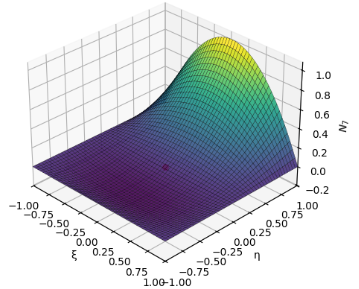
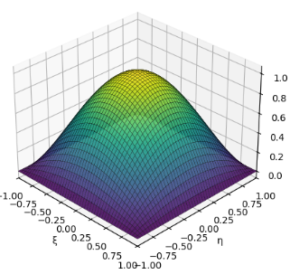
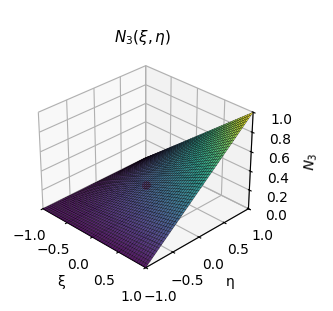
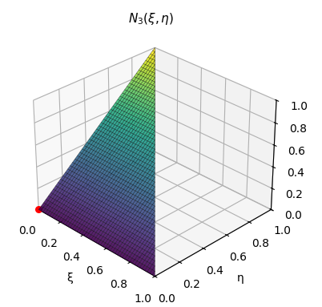
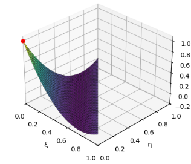
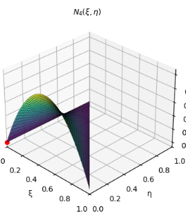
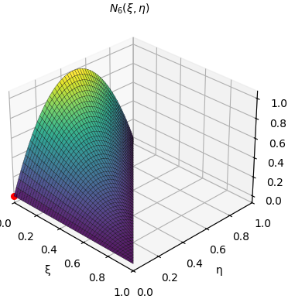
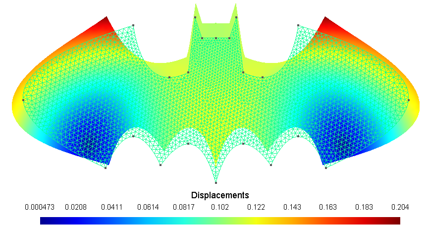

# FEM – Finite Element Analysis

A Python library for structural analysis using the Finite Element Method, developed for educational and research purposes in civil and structural engineering.

> Based on the FEM course by Prof. José Abell — Universidad de los Andes.
---

## Features

- Modular element library covering 1D, 2D, and membrane elements.
- Implements the following element types:
  - **Truss2D** – 2-node axial element (2 DOF/node)
  - **Frame2D** – 2-node Euler-Bernoulli beam-column (3 DOF/node)
  - **CST** – Constant Strain Triangle (3 nodes · 6 DOF)
  - **LST** – Linear Strain Triangle (6 nodes · 12 DOF)
  - **Quad4** – Bilinear Quadrilateral (4 nodes · 8 DOF)
  - **Quad9** – Biquadratic Lagrangian Quadrilateral (9 nodes · 18 DOF)
- Full isoparametric formulation with Gauss-Legendre numerical integration.
- Direct Stiffness Method (DSM) assembly pipeline.
- gmsh-based mesh generation and node/element import.
- Interactive Jupyter widgets for visualization of shape functions, Jacobian fields, B-matrix, and stiffness integrand components.
- Rigid body mode verification for membrane elements.

---

## Requirements

- Python 3.8 or higher
- Python libraries:
  - `numpy`
  - `scipy`
  - `sympy`
  - `matplotlib`
  - `gmsh`
  - `ipywidgets`
  - `jupyter`

---

## Installation

Clone the repository and install dependencies:

```bash
git clone https://github.com/ppalacios92/FEM.git
cd FEM
pip install -e .
```

---

## Repository Structure

```bash
FEM/
├── src/
│   └── fem/
│       ├── core/             # Node, Material, parameters
│       ├── elements/         # CST, LST, Quad4, Quad9, Truss2D, Frame2D
│       ├── sections/         # Membrane section
│       └── utils/            # functions, gmshtools, visualization, units
├── examples/                 # Jupyter notebooks with usage examples
├── docs/
│   └── images/               # Reference plots and visualization outputs
└── README.md
```

---

## Import Modules

```python
from fem import (
    Node, Material, Membrane,
    CST, LST, Truss2D, Frame2D, Quad4, Quad9,
    read_mesh, build_nodes, build_elements, build_load_vector,
    mm, cm, m, kN, MPa, GPa,
    globalParameters,
)
```

---

## Plotting

The library includes a built-in plotting module (`fem.utils.plotting`) for visualizing FEM results directly in Jupyter or any matplotlib environment. All functions follow a consistent interface and support exporting to file.

| Function | Description |
|---|---|
| `plot_mesh` | Mesh geometry with node/element labels and support symbols |
| `plot_loads_2d` | Normalized load arrows over mesh background |
| `plot_deformed` | Deformed shape colored by displacement component (`ux`, `uy`, `umag`) |
| `plot_field_2d` | Stress or strain field with smooth contour surface (`sxx`, `syy`, `vmis`, ...) |

All plot functions accept `show_element_edges`, `show_node_points`, `show_supports`, `figsize`, `ax`, and `save` for full control over the output.

---

## gmsh Integration

The `read_mesh` function reads a `.msh` file generated by gmsh and returns a structured dictionary containing nodes, elements, and physical groups — all in a single call:

```python
mesh = read_mesh('mesh.msh')
```

The mesh dictionary exposes three keys:

- `mesh['nodes']` — node tags and their `(x, y, z)` coordinates
- `mesh['elements']` — element connectivity grouped by physical group ID
- `mesh['physical_groups']` — physical group metadata (name and dimension)

This structure maps directly to the FEM workflow (`build_nodes`, `build_elements`, `build_load_vector`) and connects naturally to **OpenSeesPy** — nodes, boundary conditions, and elements can be built by iterating directly over the mesh dictionary without any intermediate conversion.

---

## Basic Usage

```python
import numpy as np
from fem import Node, Material, Membrane, Quad4
from fem import read_mesh, build_nodes, build_elements, build_load_vector
from fem import MPa, mm

# Material and section
Steel = Material(name='Steel', E=200000.0, nu=0.30, rho=0.0)
Plate = Membrane(name='Plate', thickness=10.0, material=Steel)

# Dictionaries
section_dictionary  = {201: Plate}
load_dictionary     = {50: {'value': 100.0, 'direction': 'x'}}
restrain_dictionary = {101: ['r', 'r']}

# Build model from gmsh mesh
mesh                = read_mesh('mesh.msh')
node_map, nodes     = build_nodes(mesh, restrain_dictionary)
elements            = build_elements(mesh, node_map, section_dictionary, {4: Quad4})

# Assembly and solve
# ..(see examples/ for full workflows)
```

---

## 🛑 Disclaimer

This library is developed for educational purposes in the context of the Finite Element Method course at Universidad de los Andes. Results should always be validated against reference solutions and established FEM software.

The author assumes no responsibility for incorrect use, misinterpretation of results, or consequences of numerical errors.

---

## Author

Developed by **Patricio Palacios B. - Nicolas Mora Bowen**
GitHub: [@ppalacios92](https://github.com/ppalacios92)
GitHub: [@nmorabowen](https://github.com/nmorabowen)

---

## How to Cite

```bibtex
@misc{palacios2025fem,
  author       = {Patricio Palacios B., Nicolas Mora Bowen},
  title        = {FEM: A Python Library for Finite Element Analysis},
  year         = {2025},
  publisher    = {GitHub},
  journal      = {GitHub repository},
  howpublished = {\url{https://github.com/ppalacios92/FEM}}
}
```

**APA (7th Edition):**
Palacios P. , Mora Bowen N. (2025). *FEM: A Python library for finite element analysis* [Computer software]. GitHub. https://github.com/ppalacios92/FEM

---

## License

This project is licensed under the MIT License – see the LICENSE file for details.

---

## Contributing

Contributions are welcome! Feel free to submit pull requests, report bugs, or suggest new features through the GitHub issues page.

---

## Get Fun with FEM!

Interactive visualizations included in this library — explore shape functions, Jacobian fields, and stiffness integrands live in Jupyter.

|  |  |  |  |
|:---:|:---:|:---:|:---:|
|  |  |  |  |

## Why not?

|  |
|:---:|